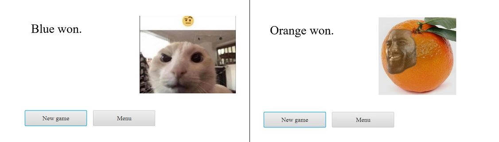

# The Drake game implementation
This project is a semester work for the Java course at CTU in Prague. A moderately complex game, with chess-like rules.
The game has its own set of rules, that will be briefly described.
The implementation contains the UI, which is performed with JavaFX.

## The rules
The first stage of the game is setting up the bases of each player. Two players, orange :orange: and blue :blueberries:, place 3 of their units on the board (The Drake and 2 clubmen).
Then the middle phase of the game starts, when players are allowed to either set new units on the board or attack the units of another player.
All the available moves of a particular unit are interactively shown when this unit is selected with a mouse click.
The game ends when one player manages to strike The Drake unit of another player.

## The UI
The app opens a quite uplifting main menu, where you can choose to either leave the game or start a new game with another player:

  

After selecting the game, the second scene rises up and shows the game-board. All the available placing moves are shown, when the user clicks the place from stack button.
When the particular unit is clicked on, however, its moves and attacks are visualized.

  

One of The Drakes has fallen and the game over screen salutes the winner.

  

## Game process example

The process of a short un-thinking game is shown in a gif below:

  

> The idea of this project was provided by FIT CTU in Prague.
> So, the usage is probably forbidden and the plagiarism of the code (especially in the Java course at FIT) will probably be punished, don't risk it :frog:

